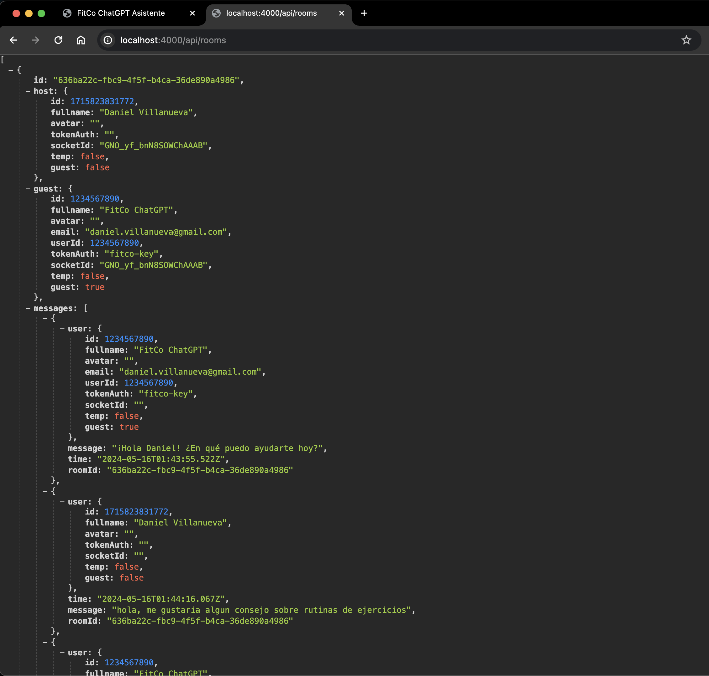
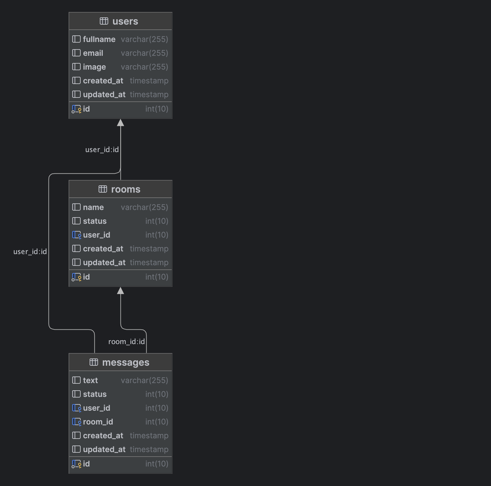

# FitCo by @danieljvx

## App FitCo ChatBot


## Api Rooms



## Data Base Diagram



## Steps one by one

### `1 - Copy .env Web app:`
```bash
$ cd web
$ copy .env.example .env
# cd ..
```

### `2 - Copy .env Api app:`
```bash
$ cd api
$ copy .env.example .env
# cd ..
```

### `3 - GPT_KEY .env: En la variable GPT_KEY agregar la key de ChatGPT para la integración`
```bash
$ nano .env
GPT_KEY=""
```

### `4 - Up Docker Containers db, api, web:`
```bash
# (db, api, web)
$ docker-compose up
```

### `Local Apps:`
| Resource            | Url                                                                                        |
|---------------------|--------------------------------------------------------------------------------------------|
| web     | [http://localhost:3000](http://localhost:3000)                                             |
| api  | [http://localhost:4000/api/rooms](http://localhost:4000/api/rooms)                             |


## Daniel Villanueva

- Email: [villanueva.danielx@gmail.com](mail://villanueva.danielx@gmail.com)

- Github: [@danieljvx](https://github.com/danieljvx)

- Linkedin - [Daniel Villanueva](https://www.linkedin.com/in/danieljx)